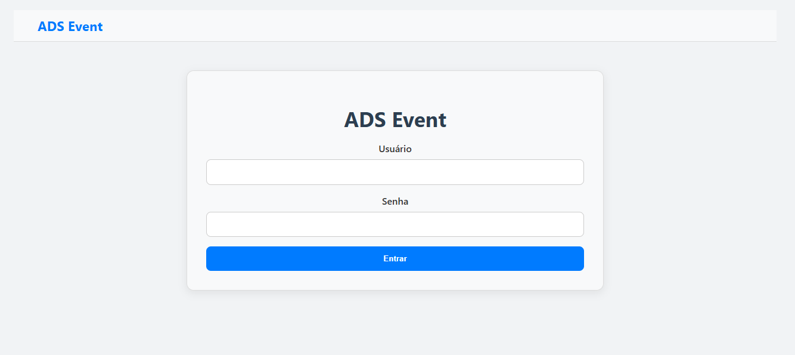
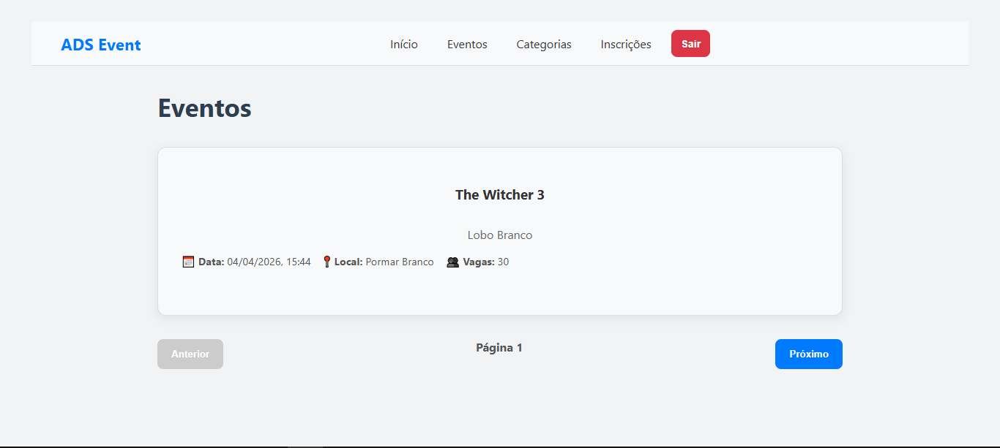
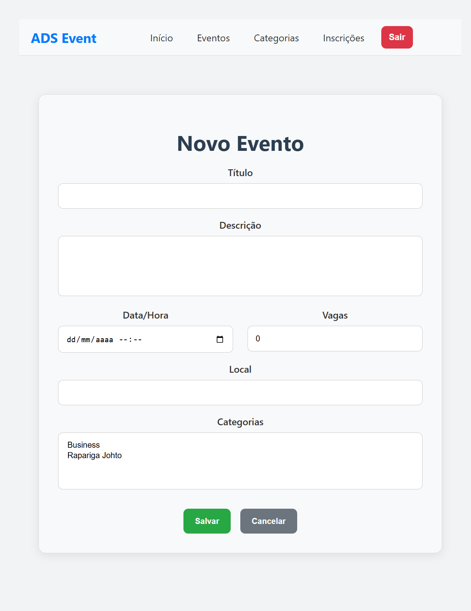
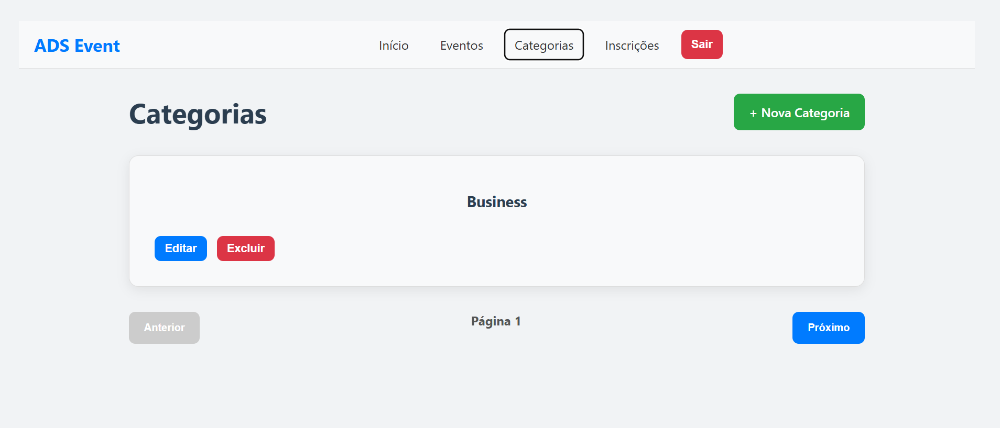

# 🎯 ADS Event - Sistema de Gerenciamento de Eventos

[](https://www.djangoproject.com/)
[](https://reactjs.org/)
[](https://www.typescriptlang.org/)
[](https://www.postgresql.org/)

Uma aplicação web full-stack para gerenciamento de eventos acadêmicos com controle de permissões baseado em papéis (RBAC). Desenvolvida com **Django REST Framework** no backend e **React + TypeScript** no frontend.

## 📋 Visão Geral

O **ADS Event** é um sistema completo para gerenciamento de eventos, inscrições e categorias, com autenticação JWT e controle de acesso baseado em papéis. O sistema permite que usuários comuns visualizem e se inscrevam em eventos, enquanto administradores têm acesso total ao CRUD.

### ✨ Principais Funcionalidades

- 🔐 **Autenticação JWT** com refresh automático
- 👥 **Controle de Permissões RBAC** (Admin/User)
- 📅 **Gerenciamento de Eventos** (CRUD completo)
- 🏷️ **Sistema de Categorias** com soft delete
- 📝 **Inscrições em Eventos** filtradas por usuário
- 🎨 **Interface Responsiva** com React + TypeScript
- 🔄 **Integração API REST** com Axios

## 🚀 Tecnologias Utilizadas

### Backend
- **Django 5.2.7** - Framework web Python
- **Django REST Framework 3.16.1** - API REST
- **PostgreSQL** - Banco de dados relacional
- **Simple JWT** - Autenticação baseada em tokens
- **CORS Headers** - Suporte a CORS para integração frontend
- **Python 3.12+** - Linguagem de programação

### Frontend
- **React 18.3.1** - Biblioteca JavaScript para interfaces
- **TypeScript 5.2.3** - Superset JavaScript com tipagem
- **Vite 5.4.0** - Build tool e dev server
- **React Router DOM 6.8.0** - Roteamento SPA
- **Axios 1.7.0** - Cliente HTTP para APIs
- **Context API** - Gerenciamento de estado global
- **CSS Customizado** - Estilização responsiva

### DevOps & Ferramentas
- **Git** - Controle de versão
- **Virtual Environment** - Isolamento de dependências Python
- **npm** - Gerenciamento de pacotes JavaScript
- **ESLint** - Linting de código JavaScript/TypeScript

## 📦 Instalação e Configuração

### Pré-requisitos

- **Python 3.12+** instalado
- **Node.js 18+** instalado
- **PostgreSQL** instalado e configurado
- **Git** para clonar o repositório

### 1. Clone o Repositório

```bash
git clone <url-do-repositorio>
cd ADSEvent
```

### 2. Configuração do Backend

#### Crie e ative o ambiente virtual:
```bash
python -m venv .venv
# Windows
.venv\Scripts\activate
# Linux/Mac
source .venv/bin/activate
```

#### Instale as dependências:
```bash
pip install -r backend/requirements.txt
```

#### Configure o banco de dados:
- Crie um banco PostgreSQL chamado `adsevent`
- Atualize as configurações em `backend/ADSEvent/settings.py` se necessário
- Mantenha o arquivo de ambiente em `backend/.env`

#### Execute as migrações:
```bash
python backend/manage.py migrate
```

#### (Opcional) Crie um superusuário:
```bash
python backend/manage.py createsuperuser
```

### 3. Configuração do Frontend

#### Navegue para o diretório frontend:
```bash
cd frontend
```

#### Instale as dependências:
```bash
npm install
```

### 4. Executando a Aplicação

#### Backend (em um terminal):
```bash
python backend/manage.py runserver
```
API disponível em: `http://127.0.0.1:8000/`

#### Frontend (em outro terminal):
```bash
cd frontend
npm run dev
```
Aplicação disponível em: `http://localhost:5173/`

## 🔧 Scripts Disponíveis

### Backend
```bash
python backend/manage.py runserver          # Inicia servidor de desenvolvimento
python backend/manage.py migrate            # Executa migrações do banco
python backend/manage.py createsuperuser    # Cria usuário administrador
python backend/manage.py makemigrations     # Cria novas migrações
```

### Frontend
```bash
npm run dev        # Inicia servidor de desenvolvimento
npm run build      # Build para produção
npm run preview    # Preview do build de produção
npm run lint       # Executa linting
```

## 📁 Estrutura do Projeto

```
backend/
├── manage.py                    # Script de gerenciamento Django
├── requirements.txt             # Dependências Python
├── .env                         # Variáveis de ambiente do backend
├── ADSEvent/                    # Configurações Django
│   ├── settings.py
│   ├── urls.py
│   └── wsgi.py
├── core/                        # App principal
│   ├── models.py               # Modelos de dados
│   ├── views.py                # Views Django
│   ├── api/
│   │   └── v1/
│   │       ├── viewsets.py     # ViewSets DRF
│   │       ├── serializers.py  # Serializers
│   │       └── router.py       # Configuração de rotas API
│   ├── migrations/             # Migrações do banco
│   └── templates/              # Templates HTML
frontend/                    # Aplicação React
│   ├── src/
│   │   ├── components/         # Componentes reutilizáveis
│   │   ├── pages/              # Páginas da aplicação
│   │   ├── contexts/           # Contextos React
│   │   ├── hooks/              # Hooks customizados
│   │   ├── services/           # Serviços de API
│   │   └── types/              # Definições TypeScript
│   ├── package.json
│   └── vite.config.ts
logs/                        # Arquivos de log
```

## 🔐 Sistema de Autenticação

### Endpoints de Autenticação
- `POST /api/v1/auth/login/` - Login com username/password
- `POST /api/v1/auth/logout/` - Logout com invalidação de token
- `GET /api/v1/auth/user/` - Dados do usuário autenticado

### Controle de Acesso (RBAC)
- **Usuário Comum**: Visualização e inscrições
- **Administrador**: Acesso total ao CRUD

## 📊 API Endpoints

### Eventos
- `GET /api/v1/events/` - Lista eventos
- `POST /api/v1/events/` - Cria evento
- `GET /api/v1/events/{id}/` - Detalhes do evento
- `PUT /api/v1/events/{id}/` - Atualiza evento
- `DELETE /api/v1/events/{id}/` - Remove evento

### Categorias
- `GET /api/v1/categories/` - Lista categorias
- `POST /api/v1/categories/` - Cria categoria
- `PUT /api/v1/categories/{id}/` - Atualiza categoria
- `DELETE /api/v1/categories/{id}/` - Remove categoria

### Inscrições
- `GET /api/v1/subscriptions/` - Minhas inscrições
- `POST /api/v1/subscriptions/` - Inscrever-se em evento
- `DELETE /api/v1/subscriptions/{id}/` - Cancelar inscrição

## 🧪 Testando a Aplicação

### Credenciais de Teste
- **Username**: `admin`
- **Password**: `admin123`

### Fluxo de Teste
1. Acesse `http://localhost:5173/login`
2. Faça login com as credenciais acima
3. Navegue pelas funcionalidades do sistema
4. Teste as permissões (botões aparecem apenas para admin)

## 📸 Screenshots e Demonstrações

### Tela de Login


### Dashboard de Eventos


### Formulário de Evento


### Lista de Categorias (Admin)



> **Nota**: As imagens devem ser adicionados na pasta `screenshots/`

## 🤝 Contribuição

1. Fork o projeto
2. Crie uma branch para sua feature (`git checkout -b feature/AmazingFeature`)
3. Commit suas mudanças (`git commit -m 'Add some AmazingFeature'`)
4. Push para a branch (`git push origin feature/AmazingFeature`)
5. Abra um Pull Request

## 📝 Licença

Este projeto está sob a licença MIT. Veja o arquivo `LICENSE` para mais detalhes.

## 👥 Equipe de Desenvolvimento

- **Déborah**: Autenticação e Contexto Global
- **João**: Integração API e CRUD
- **Iago**: Interface e Componentes
- **Ronaud**: Páginas e Navegação

## 📞 Suporte

Para dúvidas ou problemas, abra uma issue no repositório ou entre em contato com a equipe de desenvolvimento.

---

**ADS Event** - Sistema de Gerenciamento de Eventos Acadêmicos 🎓
